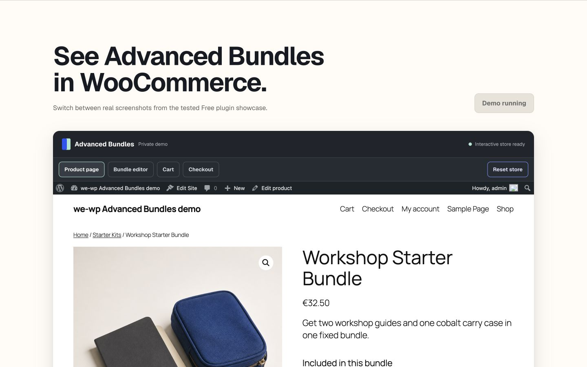

# we-wp plugin demo platform

[](LICENSE)

Self-hosted browser demo platform for we-wp WooCommerce plugins.

## What works locally

- Multi-plugin hub with Advanced Bundles and linkless Advanced Invoices coming soon.
- Advanced Bundles screenshot tour plus an interactive product, editor, cart, and checkout flow.
- Pinned self-hosted WordPress Playground client, remote, service worker, WordPress 6.9, and PHP 8.3 runtimes.
- Exact pinned Free plugin ZIP, WooCommerce package, synthetic fixtures, and demo guard.
- Fresh-store reset, deterministic failure state, and in-runtime safety verification before the UI reports ready.
- Deterministic build, package, runtime-inventory, and local preview checks.

The exact upstream artifact, archive hash, full inventory hash, reduced selection hash, and browser-verification state are recorded in `blueprints/runtime.lock.json`. The retained runtime is 120,629,711 bytes across 2,063 files; the 709,583,353-byte source archive is not duplicated in the repository. See `docs/operations/runtime-import.md` for provenance and reproduction.

## Review

```sh
npm run check
npm run preview
```

Open `http://localhost:8783/plugins/advanced-bundles/`, choose **Start interactive demo**, and allow up to one minute for the first boot.

## Browser proof



[Open the 390-pixel mobile proof](screenshots/interactive-advanced-bundles-mobile-390.jpg).

## Delivery state

- Local source and preview: yes.
- Local Chromium boot, add-to-cart, editor, cart, checkout, reset, outbound block, failure state, and 390/1440 responsive proof: yes.
- Public source repository: `https://github.com/we-wp/plugin-demo-platform`.
- Forge deployment and `demo.we-wp.com` DNS/TLS: live.
- Production verified through source commit `faa0fddbe4c991fe205619cceaae387c166a6aa5`; later commits require fresh deployment and anonymous browser proof.

See `docs/architecture.md` and `docs/operations/forge-deploy.md` for the gated implementation path.
